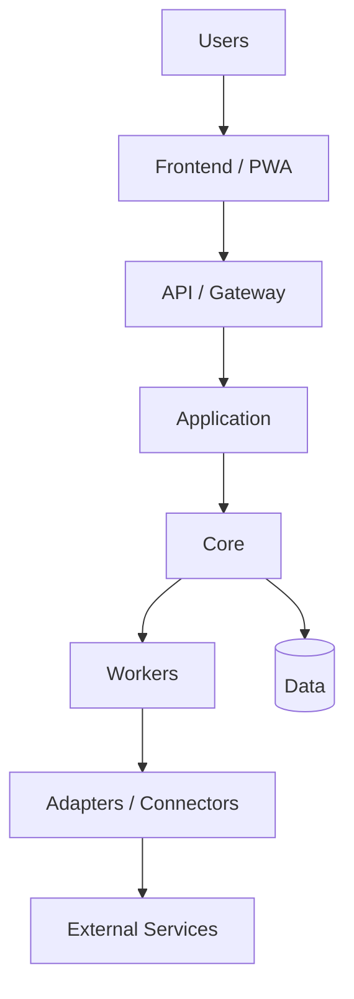

# ARCHITECTURE

## PRINCIPIO 0 — MODULAR, ESCALABLE Y PORTABLE DESDE EL NACIMIENTO

**REGLA OBLIGATORIA Y PRIORITARIA:** todo proyecto, app, servicio, módulo o nueva funcionalidad del ecosistema MVA debe diseñarse **MODULAR, ESCALABLE Y PORTABLE desde el primer día**.

Esto no es una mejora futura ni una optimización opcional. Es una condición de diseño previa a implementar.

- cada responsabilidad importante debe poder aislarse en módulos claros;
- los módulos deben tener contratos/interfaces definidos y bajo acoplamiento;
- frontend, backend, core, datos, infraestructura e integraciones deben poder evolucionar sin rehacer todo el sistema;
- proveedores externos deben entrar mediante adapters/connectors reemplazables;
- agregar un nuevo mercado, proveedor, portal, IA, broker, cloud, worker o interfaz no debe obligar a reescribir el core;
- escalar significa permitir crecimiento por necesidad medida, sin introducir complejidad prematura;
- toda excepción debe quedar documentada y justificada.

**Regla de aceptación:** si una solución resuelve el problema inmediato pero bloquea la modularidad o el crecimiento razonable del proyecto, no cumple el estándar MVA.

## Principios
MODULAR · ESCALABLE · REEMPLAZABLE · OBSERVABLE · TESTEABLE · PORTABLE · DOCUMENTADO

## System Overview

## Modules
Documentar cada módulo con responsabilidad, inputs, outputs, dependencias, interfaz y estado.

## Portabilidad

La infraestructura debe ser provider-neutral. AWS, GCP, Azure, VPS, Vercel, Cloudflare o local son destinos/adapters, no dependencias existenciales del core.

Todo proyecto debe documentar:
- install;
- doctor;
- backup/export;
- restore;
- verify;
- migrate/cutover;
- rollback.

## Seguridad
Ver `docs/SECURITY_MODEL.md`.

## Observabilidad
Definir logs, métricas, health checks y alertas según madurez.

## Escalabilidad
Escalar sólo por necesidad medida. Evitar complejidad prematura.
