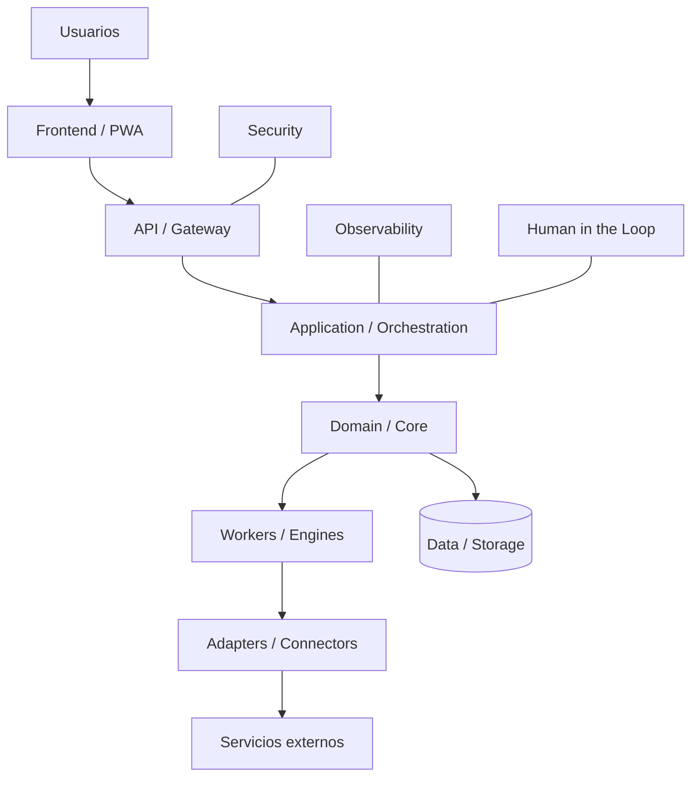
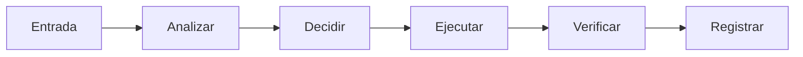

# PROJECT NAME

> **MVA APP MOLD** — este repositorio nace desde `MVA-PROJECT-TEMPLATE` y debe conservar desde el primer commit tres propiedades no negociables: **MODULAR · ESCALABLE · PORTABLE**.

**MVA-PROJECT-DESIGN** define las reglas maestras. **MVA-PROJECT-TEMPLATE** es el molde ejecutable desde el cual nace cada nueva app.

## PRINCIPIO 0 — MODULAR Y ESCALABLE DESDE EL NACIMIENTO

**REGLA OBLIGATORIA Y PRIORITARIA:** este proyecto debe diseñarse **MODULAR Y ESCALABLE desde el primer día**.

No es una mejora futura ni una optimización opcional. Cada módulo debe tener responsabilidad clara, contratos definidos y bajo acoplamiento. Frontend, backend, core, datos, infraestructura e integraciones deben poder evolucionar de forma independiente. Los proveedores externos deben entrar mediante adapters/connectors reemplazables.

Si una solución resuelve el problema inmediato pero bloquea el crecimiento razonable del proyecto, no cumple el estándar MVA.

## PRINCIPIO 0 — MODULAR Y ESCALABLE DESDE EL NACIMIENTO

**REGLA OBLIGATORIA Y PRIORITARIA:** todo proyecto, app, servicio, módulo o nueva funcionalidad del ecosistema MVA debe diseñarse **MODULAR Y ESCALABLE desde el primer día**.

Esto no es una mejora futura ni una optimización opcional. Es una condición de diseño previa a implementar.

- cada responsabilidad importante debe poder aislarse en módulos claros;
- los módulos deben tener contratos/interfaces definidos y bajo acoplamiento;
- frontend, backend, core, datos, infraestructura e integraciones deben poder evolucionar sin rehacer todo el sistema;
- proveedores externos deben entrar mediante adapters/connectors reemplazables;
- agregar un nuevo mercado, proveedor, portal, IA, broker, cloud, worker o interfaz no debe obligar a reescribir el core;
- escalar significa permitir crecimiento por necesidad medida, sin introducir complejidad prematura;
- toda excepción debe quedar documentada y justificada.

**Regla de aceptación:** si una solución resuelve el problema inmediato pero bloquea la modularidad o el crecimiento razonable del proyecto, no cumple el estándar MVA.

> Basado en **MVA-PROJECT-DESIGN**

## Qué es
Descripción clara del producto.

## Problema que resuelve
Definir problema, usuario y valor.

## Estado actual

| Área | Estado | Progreso |
|---|---|---:|
| Producto | 🟡 En desarrollo | 10% |
| Frontend | ⬜ Planeado | 0% |
| Backend | ⬜ Planeado | 0% |
| Integraciones | ⬜ Planeado | 0% |
| Testing | ⬜ Planeado | 0% |
| Observabilidad | ⬜ Planeado | 0% |
| Documentación | 🟡 En desarrollo | 20% |

Los porcentajes deben responder a criterios reales.

## Arquitectura



## Flujo principal



## Funcionalidades

### ✅ Operativo
- Ninguna todavía.

### 🟡 En desarrollo
- Bootstrap inicial.

### ⬜ Planeado
- Ver ROADMAP.md.

## Screenshots

Las capturas reales deben vivir en `docs/screenshots/`, actualizarse cuando cambie significativamente la UI y mostrarse también directamente en este README.

### Mobile

<p align="center">
  
</p>

### Desktop / Web

<p align="center">
  
</p>

No insertar capturas mobile a tamaño completo. No usar mocks como evidencia de estado real.

## Stack tecnológico
Pendiente.

## Estructura del repositorio

```text
frontend/
backend/
core/
adapters/
workers/
infrastructure/
tests/
scripts/
docs/
```

## Inicio rápido
Ver `docs/DEVELOPER_GUIDE.md`.

## Manual de usuario
Ver `docs/USER_MANUAL.md`.

## Operaciones
Ver `docs/OPERATIONS_MANUAL.md`.

## Roadmap
Ver `ROADMAP.md` y el GitHub Project asociado.

## Estado del proyecto
Ver `PROJECT_STATUS.md`.

## Project Ledger
Ver `PROJECT_LEDGER.md`. Es la memoria operativa del proyecto: metas, pedidos, checkpoints, problemas, soluciones, decisiones y evidencia.

## Portabilidad
Todo proyecto debe definir desde el bootstrap cómo instalar, diagnosticar, exportar, restaurar, verificar, migrar y hacer rollback. La baseline debe vivir bajo `infrastructure/portable/` o equivalente.

## Estados del sistema
Ver `docs/SYSTEM_STATES.md`.

## Seguridad
Ver `docs/SECURITY_MODEL.md`.

## Licencia
Ver `LICENSE`.

## Regla de entrega

DESARROLLO → CLOUDFLARE TEMPORAL → AUDITORÍA → ITERACIÓN → APROBACIÓN → PRODUCCIÓN
