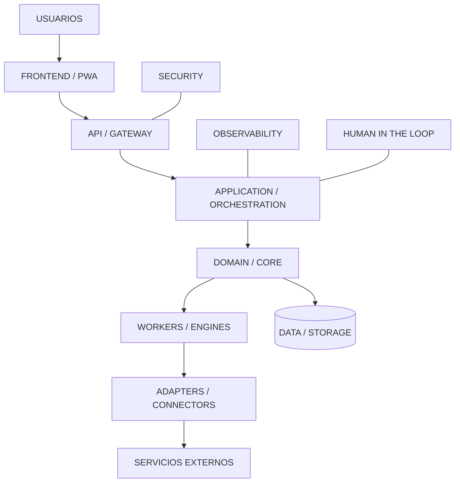

# SYSTEM DESIGN 101

```mermaid
flowchart TD
    U[USUARIOS] --> F[FRONTEND / PWA]
    F --> G[API / GATEWAY]
    G --> O[APPLICATION / ORCHESTRATION]
    O --> C[DOMAIN / CORE]
    C --> W[WORKERS / ENGINES]
    W --> A[ADAPTERS / CONNECTORS]
    A --> E[SERVICIOS EXTERNOS]
    C --> D[(DATA / STORAGE)]
    S[SECURITY] --- G
    B[OBSERVABILITY] --- O
    H[HUMAN IN THE LOOP] --- O
```
